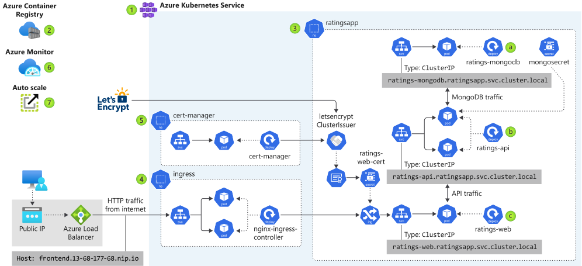
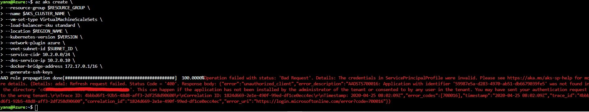
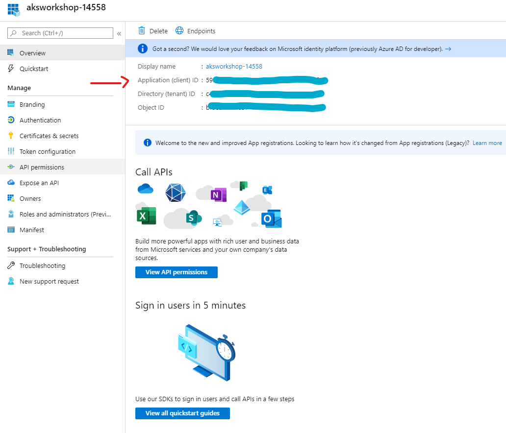
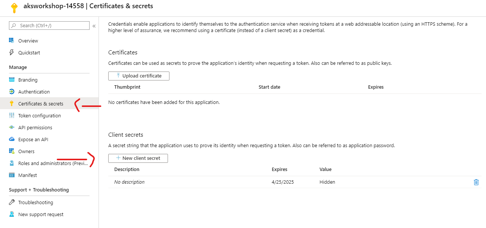

# Azure-Kubernetes-Service-Workshop
Our goal is to deploy an Azure managed Kubernetes service, Azure Kubernetes Service (AKS), that runs the Fruit Smoothies ratings website in the following series of exercises

# Application architecture

Is not a secret that Microsoft has been investing a lot in trainings and on their documentation, recently I've been following this [AKS Workshop](https://docs.microsoft.com/en-us/learn/modules/aks-workshop/) . If you're looking to improve your basic knowledge of K8S this Workshop is a great place where to start, instead if you're totally new to K8S I recommend you to refer to [Brendan Burns's Video Series](https://www.youtube.com/watch?v=q1PcAawa4Bg&list=PLLasX02E8BPCrIhFrc_ZiINhbRkYMKdPT&index=1) in my opinion he has done a great job explain different concepts around K8S.

In this [AKS workshop](https://docs.microsoft.com/en-us/learn/modules/aks-workshop/), you will:

* Create an Azure K8S cluster
* Choose the best deployment options for you Pods
* Expose Pods to internal and external network users
* Configure SSL/TLS for Azure K8S ingress
* Monitor the health of an Azure K8S cluster
* Scale your application in an Azure K8S cluster

# Work-around

- Unit 2 of 11
  - Create the AKS cluster

if you receive the following error:

you can fix it adding to the <code>az aks create</code> command --service-principal ApplicationID & --client-secret SecretID

